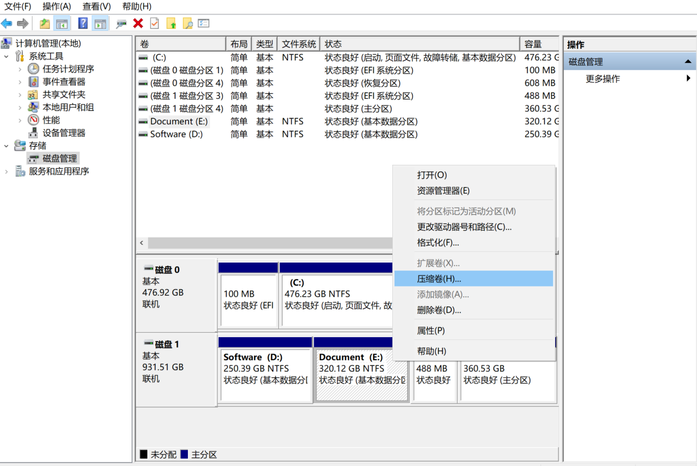
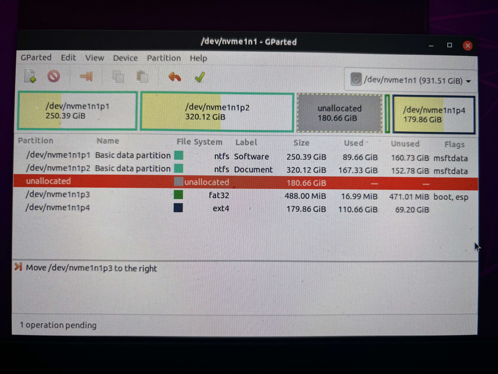
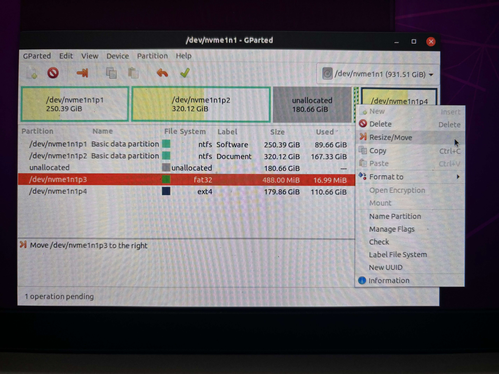
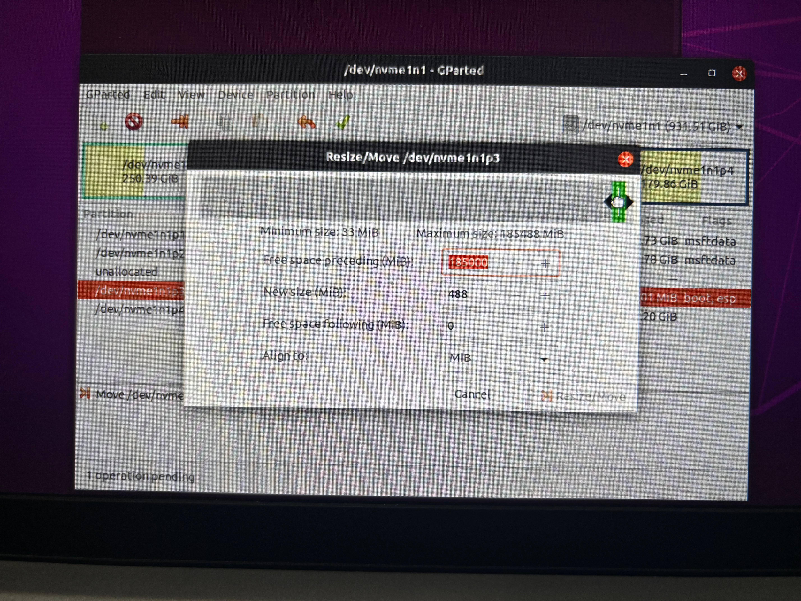
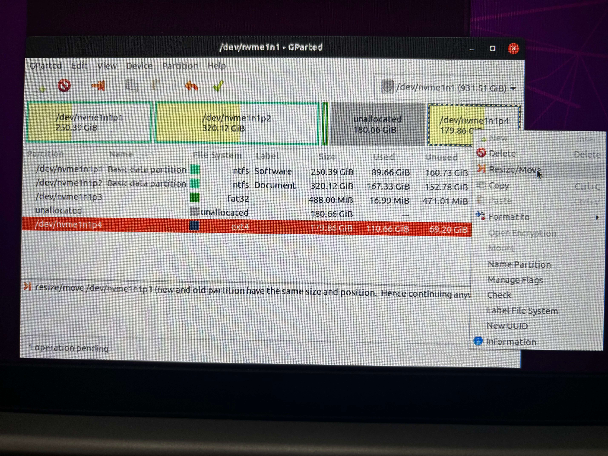
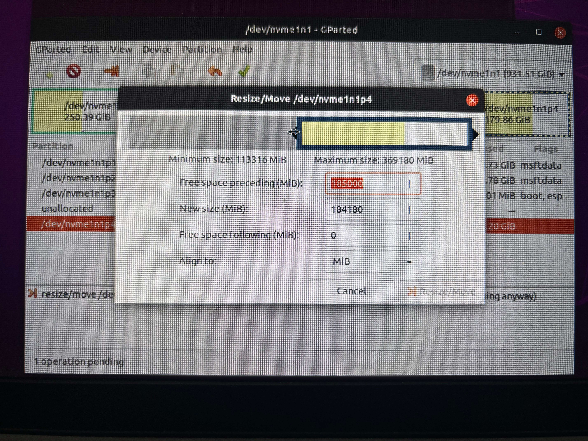
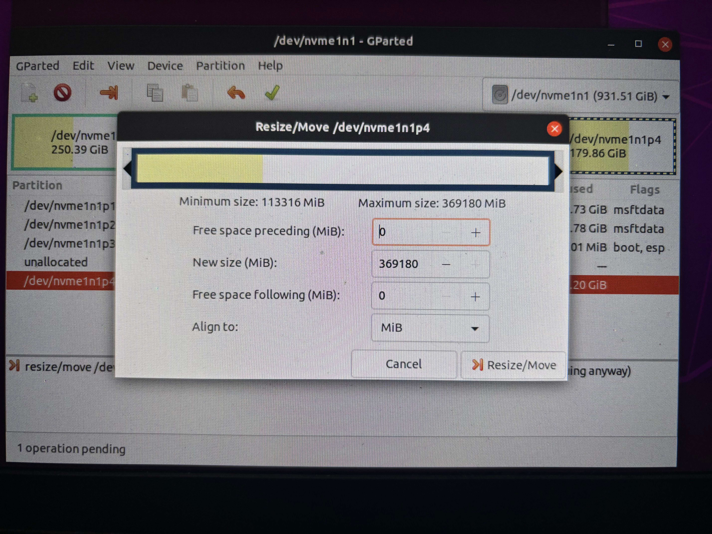
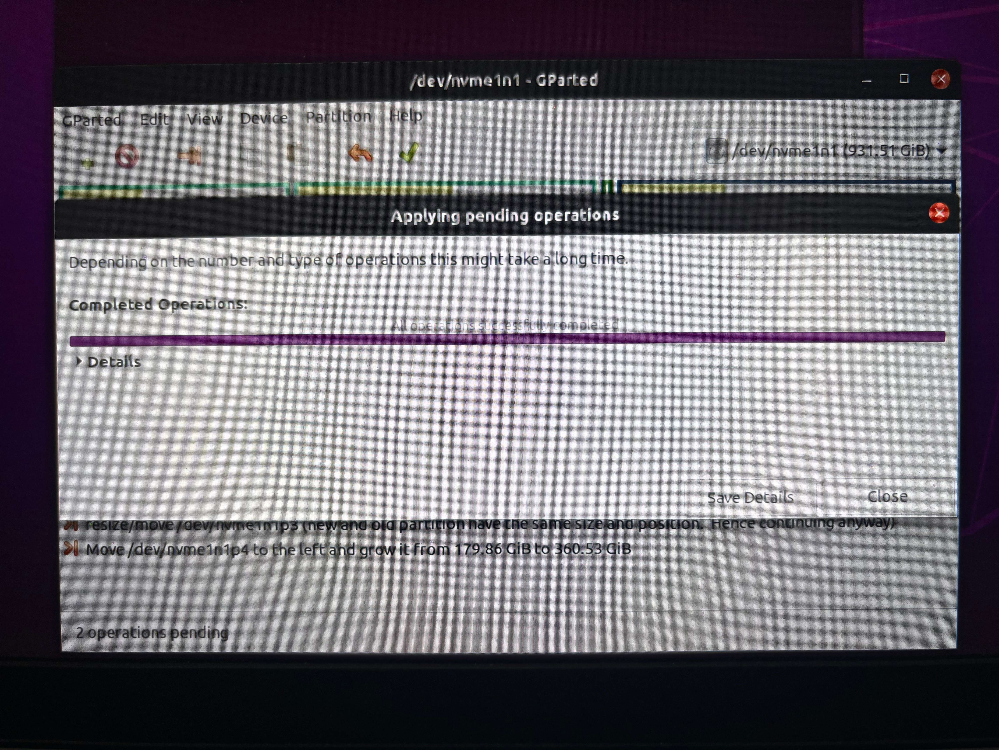

# 根目录扩容
## 一、分配空闲空间

首先在Windows下创建出一块未分配空间，找一块有空闲的卷压缩就行，最好和Ubuntu的空间挨着，不挨着也行，就麻烦些

## 二、利用gparted扩容
1、用U盘启动Ubuntu系统，进去之后点击试用系统（Try Ubuntu）/关掉引导安装


2、进入系统打开终端启动gparted
```Bash
#启动gparted
sudo gparted
#如果未安装
sudo apt install gparted
```
### 可以看到现在未分配空间和/目录空间之间有一块fat32的引导区，但gparted只能对相邻的空间进行扩容，所以我们要想办法把空间拿移动过去


操作方法如下：
1、选择紧邻未分配空间的区域选择Resize/Move


2、注意看把鼠标放在要分配的空间上会变成一个小手，我们按住他把他移动到另一边


3、现在可以看到未分配空间和/目录空间是紧邻的关系了（如果未分配空间和根目录相邻较远，那就重复以上操作直到紧邻），此时我们就可以对根目录进行扩容了


4、把鼠标放在紧邻灰色空间（未分配空间）的边缘，当鼠标标识变成拉伸箭头时，将其拉至空间的另一头，再点击Resize/Move进行确认




5、之后接可以看到已经分配好的空间，最后点击上方的对勾进行应用、在弹出的窗口点击apply等待片刻即可。


## 三、重启电脑

**文章转载于**  
[《CSDN博客——双系统Ubuntu20.04根目录（/目录）扩容，适用空间不相邻》](https://blog.csdn.net/m0_62979274/article/details/147493850?ops_request_misc=%257B%2522request%255Fid%2522%253A%25225d5442ebb2c4bfc93cb9788e88357bb3%2522%252C%2522scm%2522%253A%252220140713.130102334..%2522%257D&request_id=5d5442ebb2c4bfc93cb9788e88357bb3&biz_id=0&utm_medium=distribute.pc_search_result.none-task-blog-2~all~top_positive~default-1-147493850-null-null.142^v102^pc_search_result_base4&utm_term=%E5%8F%8C%E7%B3%BB%E7%BB%9Fubuntu%E6%89%A9%E5%AE%B9&spm=1018.2226.3001.4187)
